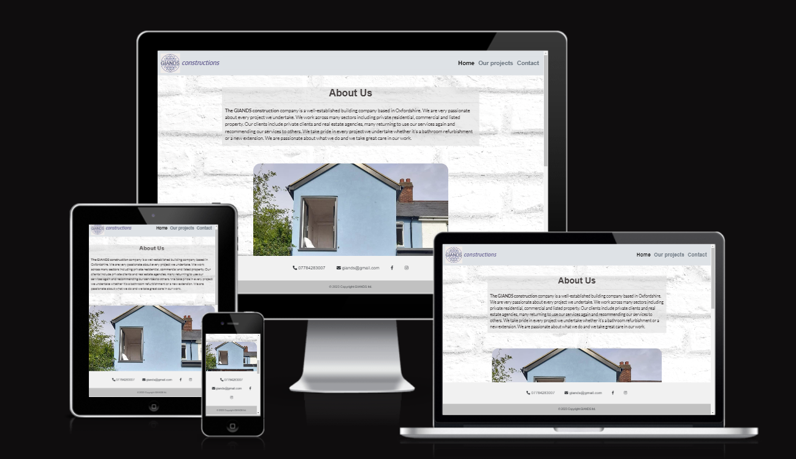

# GIANDS constructions - A milestone project

## Introduction

This is my first milestone project and the first website I've ever designed. I decided to create a website for my husband's building  company as it made the project realistic, practical and useful. This project is a functional static-website, built mainly with HTML and CSS. In the future I'd like to revisit the project and implement other languages and technologies that will be covered in the next modules of the course. I'd also like to add a real time-snap video on a home page , (instead of a youtube video as a placeholder), and add more photos to the gallery.  

[Visit the website here](https://agyluczak.github.io/GIANDS-the-building-company/)

[Wirefrmaes](./docs/GIANDS%20wireframes.pdf)

## **UX-User Experience Design**
---
### **Strategy Plane**

The business goals for the website:

1. To inform potential clients about the business and services it provides.
2. To attract new clients who need building services by showing them examples of previous projects.
3. To provide contact details, social links and a contact form for potential clients.
4. Build a database of potential clients who can be reached in the future for offers.
--

User stories:

1. As a first-time visitor, I want to easily understand the purpose of the website.
2. As a first-time visitor, I want to easily find information regarding the business and services it provides.
3. As a first-time visitor, I want to see examples of projects undertaken by the business.
4. As a first-time visitor, I want to see reviews from previous clients.
5. As a first-time or returning visitor, I want to easily find the contact details and social links.
6. As a first-time or returning visitor, I want to access a contact form to get a quote.
7. As a first-time and returning visitor, I want to be able to easily navigate the website. I can access all the pages easily and go back to the home page quickly.
8. As a first-time and returning visitor, I want to be able to read the text easily and see all images clearly on different devices.

