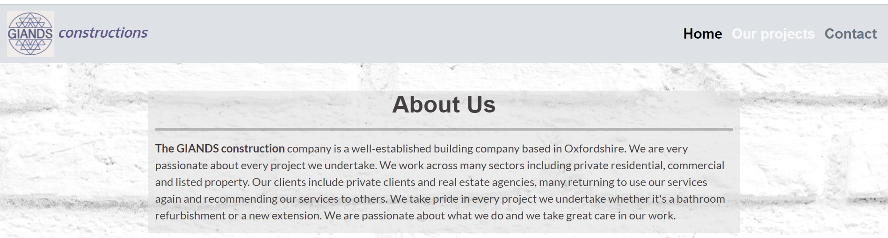
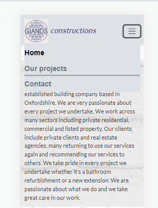

# GIANDS constructions - A milestone project

## Introduction

This is my first milestone project and the first website I've ever designed. I decided to create a website for my husband's building  company as it made the project realistic, practical and useful. This project is a functional static-website, built mainly with HTML and CSS. In the future I'd like to revisit the project and implement other languages and technologies that will be covered in the next modules of the course. I'd also like to add a real time-snap video on a home page , (instead of a youtube video as a placeholder), and add more photos to the gallery.  

[Visit the website here](https://agyluczak.github.io/GIANDS-the-building-company/)

## **UX-User Experience Design**
---
### **Strategy Plane**

The business goals for the website:

1. To inform potential clients about the business and services it provides.
2. To attract new clients who need building services by showing them examples of previous projects.
3. To provide contact details, social links and a contact form for potential clients.
4. Build a database of potential clients who can be reached in the future for offers.
--

User stories:

1. As a first-time visitor, I want to easily understand the purpose of the website.
2. As a first-time visitor, I want to easily find information regarding the business and services it provides.
3. As a first-time visitor, I want to see examples of projects undertaken by the business.
4. As a first-time visitor, I want to see reviews from previous clients.
5. As a first-time or returning visitor, I want to easily find the contact details and social links.
6. As a first-time or returning visitor, I want to access a contact form to get a quote.
7. As a first-time and returning visitor, I want to be able to easily navigate the website. I can access all the pages easily and go back to the home page quickly.
8. As a first-time and returning visitor, I want to be able to read the text easily and see all images clearly on different devices.

--

### **Scope Plane**

In order to achieve the strategy goals, the following features will be included on the website:
- The logo and the name of the company in the navbar
- Navbar, to navigate easily between the pages
- 'About us' section at the top of the Home page explaining the purpose of the business
- Caurosel with images showing previous building projects
- Time-snap video showing a project from start to finish 
- Separate 'Our Projects' page with more detailed descriptions of company's services and a gallery of completed projects
- Reviews from former clients
- Contact and social links in the footer of every page
- Separate 'Contact' page with a contact form and contact details
- Clear text and images which will be responsive on different devices

### **Structure Plane** 

The website consists of three pages:
- Home
- Our projects
- Contact

The navbar recurring on each page allows users to easily move between the pages and go back to Home Page quickly. Another reccuring element is the footer with contact details and social links. These two elements make it clear to users they are still on the same website. I used the same background colors for different sections on each page to create a certain pattern to the website. The Home Page text blocks are separated with a carousel and then followed with a video so that users are not overburden with one type of input. Similarly 'Our Projects' page is divided into a text section and a gallery of images of completed projects. The 'Contact' page contains a contact form and contact details and I felt it did not need more content to serve its purpose. 

### **Skeleton Plane**

[Wireframes](./docs/GIANDS_wireframes.pdf)

The website looks slightly different from what I initially had in mind when creating the wireframes. 

- The 'Projects' text section was moved to Our Projects Page after I decided to add a time-snap video to the Home Page. I wanted to even the content out instead of having too much of it on the first page.
- I changed the gallery section into two rows of photos instead of 'before and after' columns. The main reason for that is that I do not have enough 'before and after' authentic photos and I found it hard to find the right substitute ones on the internet. Also I found a lightbox gallery format that worked well and allowed for the images to be enlarged. 

- The Contact Page icludes  a contact form and contact details below it rather than next to it. As this page has little content, I thought there is enough space below the form for the contact details and the size of the contact form wasn't affected.

### **Surface Plane**

I used Google fonts: 'Open-Sans' for headings and 'Lato' for paragraphs. It was one of combinations sugessted on this blog:
[WebflowBlog](https://webflow.com/blog/font-pairing?utm_source=google&utm_medium=search&utm_campaign=Google-Search-Dynamic-Search-Ads-Core-BBSS&utm_term=aud-520743545921:dsa-1636392383459___585305490212___ss_paid-bb&gclid=CjwKCAjwjYKjBhB5EiwAiFdSfk6g0qClN0ZcZPRQYnjISFHh-jxs9GKXnT9Q-emoiWuNE9nWZLpGuxoCF0MQAvD_BwE)
They are very simple and easy to read, which I thought was appriopriate for a construction company. I used 'Oxygen' font for the logo to make it stand out more. The text color is dark grey. It is dark enough to contrast with the background color, but is easier on the eye than black text.

The background image is a photo of a white brickwall sourced from [istock photos](https://www.istockphoto.com/). I wanted a background image that would be associated with a construction field to make the purpose of the website clear. I chose the white brickwall to make the website content clear and easy to read.

I chose two background colours for the sections across the whole webiste: light grey and light purple. I wanted them to reflect the colours of the logo, and go well with the colour of the navbar and the the footer. The background colours are slighly transparent so that the background brickwall image can be seen, but they is enough opacity added to make the text content easy to read.

## **Features**

- Navbar – reccuring on ech page. It's responsive and toggles to a hamburger menu on smaller screens. Menu items are coloured black when active and grey when inactive. The menu items for inactive pages change tothe white colour when hovered upon. The brand name on the left also changes colour to white when hovered upon as a link back to the home page.The logo and the brand are linked to a home page when clicked.

