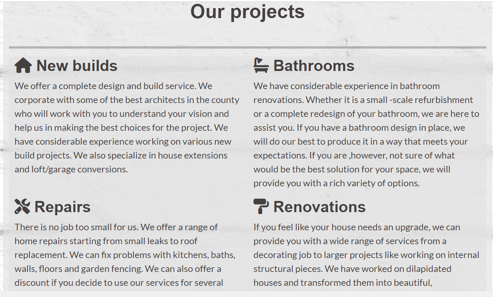
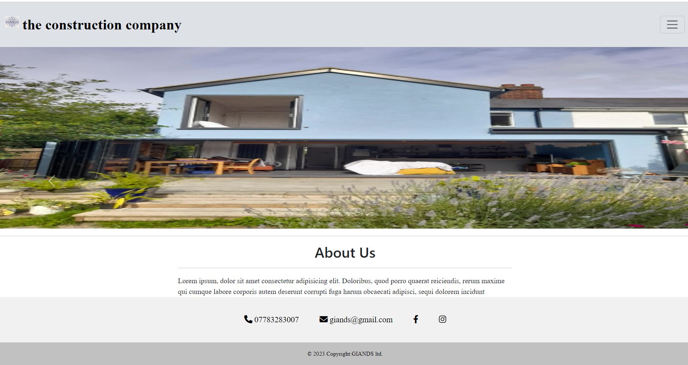

# **GIANDS constructions - A milestone project**

## **Introduction**

This is my first milestone project and the first website I've ever designed. I decided to create a website for my husband's building  company as it made the project realistic, practical and useful. This project is a functional static-website, built mainly with HTML and CSS. In the future I'd like to revisit the project and implement other languages and technologies that will be covered in the next modules of the course. I'd also like to add a real time-snap video on a home page , (instead of a youtube video as a placeholder), and add more photos to the gallery.  

[Visit the website here](https://agyluczak.github.io/GIANDS-the-building-company/)

 

## **UX-User Experience Design**

 

## **Strategy Plane**

 

**The business goals for the website:**

1. To inform potential clients about the business and services it provides.
2. To attract new clients who need building services by showing them examples of previous projects.
3. To provide contact details, social links and a contact form for potential clients.
4. Build a database of potential clients who can be reached in the future for offers.

 

**User stories:**

1. As a first-time visitor, I want to easily understand the purpose of the website.
2. As a first-time visitor, I want to easily find information regarding the business and services it provides.
3. As a first-time visitor, I want to see examples of projects undertaken by the business.
4. As a first-time visitor, I want to see reviews from previous clients.
5. As a first-time or returning visitor, I want to easily find the contact details and social links.
6. As a first-time or returning visitor, I want to access a contact form to get a quote.
7. As a first-time and returning visitor, I want to be able to easily navigate the website. I can access all the pages easily and go back to the home page quickly.
8. As a first-time and returning visitor, I want to be able to read the text easily and see all images clearly on different devices.

 

## **Scope Plane**
 

In order to achieve the strategy goals, the following features will be included on the website:
- The logo and the name of the company in the navbar
- Navbar, to navigate easily between the pages
- 'About us' section at the top of the Home page explaining the purpose of the business
- Caurosel with images showing previous building projects
- Time-snap video showing a project from start to finish 
- Separate Our Projects page with more detailed descriptions of company's services and a gallery of completed projects
- Reviews from former clients
- Contact and social links in the footer of each page
- Separate Contact Page with a contact form and contact details
- Clear text and images which will be responsive on different devices

 

## **Structure Plane** 

 

The website consists of three pages:
- **Home**
- **Our projects**
- **Contact**

The navbar recurring on each page allows users to easily move between the pages and go back to Home Page quickly. Another reccuring element is the footer with contact details and social links. These two elements make it clear to users they are still on the same website. I used the same background colours for different sections on each page to create a certain design pattern to the website. The Home Page text blocks are separated with a carousel and then followed with a video so that users are not overburden with one type of input. Similarly, Our Projects Page is divided into a text section and a photo gallery of completed projects. The Contact Page contains a contact form and contact details and I felt it did not need more content to serve its purpose. 

 

## **Skeleton Plane**

 

[Wireframes](./docs/GIANDS_wireframes.pdf)

The website looks slightly different from what I initially had in mind when creating the wireframes. 

- The 'Projects' text section was moved to Our Projects Page after I decided to add a time-snap video to the Home Page. I wanted to even the content out instead of having too much of it on the first page.
- I changed the gallery section into two rows of photos instead of 'before and after' columns. The main reason for that is that I do not have enough 'before and after' authentic photos and I found it hard to find the right substitutes on the internet. Also I found a lightbox gallery format that worked well and allowed for the images to be enlarged. 

- The Contact Page icludes a contact form and contact details below it rather than next to it. As this page has little content, I thought there is enough space below the form for the contact details and the size of the contact form wasn't affected by such arrangment.

 

## **Surface Plane**
 

I used Google fonts: 'Open-Sans' for headings and 'Lato' for paragraphs. It was one of combinations sugessted on this blog:
[WebflowBlog](https://webflow.com/blog/font-pairing?utm_source=google&utm_medium=search&utm_campaign=Google-Search-Dynamic-Search-Ads-Core-BBSS&utm_term=aud-520743545921:dsa-1636392383459___585305490212___ss_paid-bb&gclid=CjwKCAjwjYKjBhB5EiwAiFdSfk6g0qClN0ZcZPRQYnjISFHh-jxs9GKXnT9Q-emoiWuNE9nWZLpGuxoCF0MQAvD_BwE)
They are very simple and easy to read, which I thought was appriopriate for a construction company. I used 'Oxygen' font for the logo to make it stand out more. The text color is dark grey. It is dark enough to contrast with the background color, but is easier on the eye than black text.

The background image is a photo of a white brickwall sourced from [istock photos](https://www.istockphoto.com/). I wanted a background image that would be associated with a construction field to make the purpose of the website clear. I chose the white brickwall to make the website content clear and easy to read.

I chose two background colours for the sections across the whole webiste: light grey and light purple. I wanted them to reflect the colours of the logo, and go well with the colour of the navbar and the the footer. The background colours are slighly transparent so that the background brickwall image can be seen, but they is enough opacity added to make the text content easy to read.

 

## **Features**

 

- Navbar – Reccuring on each page. It's responsive and toggles to a hamburger menu on smaller screens. Menu items are coloured black when the page is active and grey when inactive. The menu items for inactive pages change to the white colour when hovered upon. The brand name on the left also changes colour to white when hovered upon.The logo and the brand are linked to a home page when clicked.

- Footer – Another feature reccuring on each page. It contains contact details and social links. It's responsive: the phone number goes above the email address and social links on a small screen. When hovered upon the links colour changes to white and the background colour becomes darker. Social links open in a new tab.

- 'About us' section. Placed on the top of the Home Page to explain the purpose of the business and its location. It provides  a short summary of the services offered by the company. The background colour is light grey and the text is dark grey making the section easy to read. 

- Carousel showing three completed projects placed in a central position below the 'About Us' section. It shows examples of services provided by the company. It's responsive and takes the whole width of a screen on smaller devices. The movement of the carousel is initiated by users by clicking on the indicators.

- Customer's feedback section with the reviews from former clients. I've used placeholders for now with made-up quotes from two celebrities. Once I get authentic reviews, this will be changed. The background colour is light purple and the text is dark grey making the text easy to read. The quotes are positioned next to each other on larger screens and stacked upon each other on smaller ones.

- Time-snap video showing a project from start to finish, placed on the bottom of the page. As I don't have an authentic video yet, I've used a placeholder sourced from youtube. The purpose of the video is to show the team in action and show different stages of a project in a more vivid way. The video is initiated by users by clicking on the play button.

- 'Our projects' section is placed at the top of Our projects page. This section describes services offered by the company in more detail. The section is divided into 4 parts, each starting with an icon and a heading next to it. The section is responive and on smaller screens the elements are placed one under the other, making the content easy to read on small devices. The background colour is light grey and the text is dark grey making it clear and easy to read.

- The gallery is placed under 'Our projects' section. I used lightbox responsive gallery. The photos are put in 2 rows of three images. On smaller screen the images are stacked on top of each other. Images  enlarge to a full screen when clicked upon. The photos show previous projects undertaken by the company. One of the images is a photo of the team.

- Contact form placed on the top of the Contact Page. Allows users to send a message and ask for a quote. The submit bottom is dark red with white text in it to make it stand out. For the time being I used Code Institute code which links to [Formdump](https://formdump.codeinstitute.net/). When the details are submitted correctly, users get the following result:

- The background image is the same throughout the whole website. It's a white brickwall which associates with the construction business. The white colour makes the rest of the content clearly visible. I used consistent background colours for the sections (light grey and light purple) to match the colours of the logo, navbar and the footer. I made the backround images slightly transparent so that the background image is still visible.
 

**Features I'd like to incorporate in the future**
 

 - I'd like to work on the carousel section and make it wider on larger screens. I had a lot of problems creating this feature, which I will describe in another section. Currently, it serves its purposes and takes the whole width on smaller screens.

 - I'd like to add more images to the gallery section and add descriptions of the projects

 - I'd like to add more text content and replace the placeholder quotes with authentic reviews.

 - I'd like to replace the placeholder video with a real time-snap video showing a real project undertaken by the company

 - I'd like the contact form to be sent to the company

 - I'd like to make the webiste more interactive once I understand how JavaScript works

 - I'd like to style the website more so it is more eye-catching. I feel it is too plain in its current form.
 
 ## **Technologies Used**
 
- [HTML](https://developer.mozilla.org/en-US/docs/Web/HTML)
    - Used as the basic building block for the project and to structure the content.

- [CSS](https://developer.mozilla.org/en-US/docs/Learn/Getting_started_with_the_web/CSS_basics)
    - Used to style all the web content across the project. 

- [Bootstrap 5.3](https://getbootstrap.com/)
    - Used as the main framework to make the project responsive.

- [jQuery](https://jquery.com/)
    - Used with Bootstrap to make the navbar responsive.

- [JavaScript](https://www.javascript.com/)
    - Used for the bootstrap navbar for extending collapse plugin to implement responsive behavior

- [Google Fonts](https://fonts.google.com/)
    - Used to obtain the fonts linked in the header, fonts used were Roboto and Dancing Script

- [Font Awesome](https://fontawesome.com/)
    - Used to obtain the social media icons used in the footer.

- [Google Developer Tools](https://developers.google.com/web/tools/chrome-devtools)
    - Used as a primary method of fixing spacing issues, finding bugs, and testing responsiveness across the project.

- [Github](https://github.com/)
    - Used to store code for the project after being pushed.

- [Git](https://git-scm.com/)
    - Used for version control by utilizing the Gitpod terminal to commit to Git and Push to GitHub.

- [Gitpod](https://www.gitpod.io/)
    - Used as the development enviroment.

- [Balsamiq](https://balsamiq.com/)
    - Used to create the wireframes for the project.

- [Lightbox gallery](https://epicbootstrap.com/snippets/lightbox-gallery)
    - Used to create responsive gallery

- [Befunky Photo Editor](https://befunky.com)
     - Used to resize and crop the images

- [AmIResponsive](http://ami.responsivedesign.is/)
    - Used to generate responsive image of the website used in README file.

- [Readme.so](https://readme.so)
    - Used to edit the readme file.

- [Tables generator](https://www.tablesgenerator.com/)
    - Used to create a table in readme file.

- [W3C Markup Validation Service](https://validator.w3.org/) 
    - Used to validate all HTML code written and used in this webpage.

- [W3C CSS Validation Service](https://jigsaw.w3.org/css-validator/#validate_by_input)
    - Used to validate all CSS code written and used in this webpage.
 

## **Testing**

 ### User Stories
  

1. **As a first-time visitor, I want to easily understand the purpose of the website.**

- When users enter the website they see the navbar with the company logo 'GIANDS constructions'. The top 'About Us' section clearly explains what services the company provides. 

- The carousel presents examples of previous buiding projects, showing clearly what the purpose of the website is.

- The time-snap video at the bottom of the page shows a building project from start to finish.

 

2. **As a first-time visitor, I want to easily find information regarding the business and services it provides.**

- 'About Us' at the top of the Home Page gives a brief summary of services offered the company. 

- Our projects Page contains a section with a more detailed description of services provided by the company. The icons add more clearance to the section. On small screens the text content is represented as one column, making it easier to read.

![Our Projects small](./docs/Our_Projects_small.pn

 

3. **As a first-time visitor, I want to see examples of projects undertaken by the business.**

- The caurosel on the Home Page and the gallery on Our Projects show examples of previous projects. 

 

4. **As a first-time visitor, I want to see reviews from previous clients.**

- The Home Page includes 'Customers' feedback' section. These are placeholders for now with made-up content. In the future I'd like to replace them with authentic reviews.

 
  

 5. **As a first-time or returning visitor, I want to easily find the contact details and social links.**

- The footer which is a recurring element across the website contains contact details and social links. When the links are hovered upon, they change the colour to white and the background color becomes darker. The social links open in a new tab.

-Contact details can be also found on the Contact Page below the contact form. 

 

6. **As a first-time or returning visitor, I want to access a contact form to get a quote.**

- The Contact Page contains a contact form. The submit bottom is very clear thanks to strongly contrasting colours: dark red and white.

 

7. **As a first-time and returning visitor, I want to be able to easily navigate the website. I can access all the pages easily and go back to the home page quickly.**

 - The Navbar enables user to easily navigate the website.  Menu items are coloured black when the page is active and grey when inactive. The menu items for inactive pages change tothe white colour when hovered upon. The brand name on the left also changes colour to white when hovered upon as a link back to the home page.The logo and the brand are linked to a home page when clicked. The navbar is responsive and toggles to a hamburger menu on smaller screens.

  

 

8. **As a first-time and returning visitor, I want to be able to read the text easily and see all images clearly on different devices.**

- The sections on the webiste have a background colour of either light grey or light purple. The backround colours are slightly transparent to show the white brickwall backround image, but at the same time have enought opacity to make the text clear and easy to read.

- I used 'Open-Sans' and 'Lato' fonts which make the text clear and easy to read. The colour of the text is dark grey which makes it clearly visible.

- The gallery images can be enlarged when clicked upon so that they can be seen more clearly.&nbsp; 

 

- This is a fully responsive websites and all elements can be clearly seen on all devices.

 

### Further Testing
 

- The website was tested on the following browsers:

| BROWSER  | RESULT  |
|---|---|
|  Google Chrome | Success |
| Microsoft Edge  | Success |
| Opera  | Success |
|  Mozilla Firefox | Success |
 
---
 

I used Chrome Developer tools to simulate the following devices:
- iphone SE
- iphone XR
- iphone 12 Pro
- Pixel 5
- Samsung Galaxy S8+
- Samsung Galaxy S20 Ultra
- iPad Air 
- iPad Mini
- Surface Pro7
- Galaxy Fold 
- Samsung Galaxy A51/71
- Nest Hub 
- Nest Hub Max

The website was responsive on all these devices.

 
---
 

### **W3C Markup Validator and W3C CSS Validator.**

I validated each page with W3C Markup Validator and W3C CSS Validator.

- [W3C Markup Validator](https://validator.w3.org/)
    - Home Page - the validator showed me the following error:

    

    As this is an embedded youtube video, I decided to leave it in the code as I felt hesitant about changing anything in the code.

    - Our Projects Page - no errors

    

    - Contact Page - no errors 

    

- [W3C CSS Validator](https://jigsaw.w3.org/css-validator/)

    - CSS - no errors

    

 

### **Lighthouse**

I used Lighthouse for testing the website's performance.
Here are the initial results:

 

I followed my mentor's tips and focused on how to improve the performance of the websites by implementing the following changes:
 - I added aria-hidden:"true" attributes and class="visually-hidden" to the social icons
 - Made sure all the headings are sequential 
 - Icreased the contrast between the text and the backround colour by adding opacity to the latter
 - Incresed the colour contrast of the submit button

 I also added alt attributes to all the images and changed their format from jpg to png.

 This is the result after the above changes were made:

  
 
 

  

## **Known bugs and fixes**

 

1.  **The footer wouldn't stick to the bottom of the page.**
- ***Solution:*** added fixed-bottom class to the footer (found on Stackoverflow)

2.	**Fixed bottom footer covered the text, making scrolling impossible**
- ***Solution:*** added padding-bottom to the body (Credit: Stackoverflow)

3. **Quotes columns displayed as rows**
- ***Solution:*** Removed one of the row classes and got rid of unnecessary divs

4. **On small devices there was extra horizontal space**
- ***Solution:*** added overflow-x: hidden to the html and body in CSS (credit to Stackoverflow)

5. **Fontawesome icons wouldn't load.** 
- ***Solution:*** the icons I chose were not for free. I used 'free' filter and chose different ones.

6.	**Can't see the menu items when the Navbar is collapsed as it merges with the backround image of the website** 

 

 

- ***Solution:*** added backround college to the navbar-collapse class matching the navbar colour.

7. **Social icons wouldn't hover**
- ***Solution:*** added social-icons class in the links in html and targeted them with css 

8. **The carousel covered the whole screen**
- ***Solution:*** I put the carousel in a container and gave it size attributes. credit to Stackoverlow)

9. **The carousel images were too stretched**

 

 

- ***Solution:*** I added size attributes to carousel-inner class and the images.

10. **The carousel overlapped the text on larger screens**
- ***Solution:*** I added media query @media screen and (min-width: 1280px) to change the size of the carousel container.

11. **Gallery images were not of the same size and didn't look even**
- ***Solution:*** I tried resizing the gallery images with css to no avail. Once I cropped the images and made them the same size the problem was solved.

12. **The logo was not inline with the navbar on smaller screens and was overlapping the body of the page slightly**
- ***Solution:*** I cropped the logo and made it smaller.

13. **The code validator was showing an error with section tags.**
- ***Solution:*** I removed section tags and replaced them with div tags in parts without headings.

14. **Couldn't remove the underlining or change the colour of the contact details on the contact page**
- ***Solution:*** I added no-underline class to the link (which was making the contact details blue and underlined) and changed the colour in CSS (credit to Stackoverlow)

15. **Couldn't open the wireframes pdf file in Gitpod**
- ***Solution:*** I downloaded a pdf extension and then it worked

 

## **Deployment**

I deployed this website by using GitPages and followed these steps:

 

**Deploying a GitHub Repoitory via GitHub Pages** 

 

1. Log in to GitHub
2. In your Repository section, select repository you want to deploy
3. In the menu located at the top of this section, click *settings*
4. Select *Pages* on the left-hand menu.
5. In the *Source* section select *deploy from a branch*
6. In the *Branch* section select *main* and click *Save*
7. Scroll down to the *Git Hub Pages* section and you will see the message 'Your site is ready to be published' followed by a link to the GitHub Page Web address.

 

**Forking the GitHub Repository**
If you want to make changes to your repository without affecting it, you can make a copy of it by 'Forking' it.

 

1. Find the GitHub repository
2. In the top right corner of the page, click the *Fork* button 
3. You will now have a copy to work on

 

**Cloning the GitHub Repository**  

If you want to download a local version of the repository, you can clone it.

1. Find the GitHub repository
2. Press the arrow on the *Code* button
3. Copy the link that is shown in the drop-down
4. Open Gitpod & select the directory location where you would like the clone created
5. In the terminal type *git clone* and  paste the link you copied in GitHub
6. Press enter and your local clone will be created.

 

---

 

**Code**

- [MDB bootstrap](https://mdbootstrap.com/)
 - I used their code for the footer with social links and adapted it

- [Epic Bootstrap](https://epicbootstrap.com/snippets/lightbox-gallery)
 - I adapted their code for a responsive gallery

- [Stackoverflow](https://stackoverflow.com/)
    - I found solutions there to some of the issues described in 'Bugs and fixes' section.

- [Matt Rudge, Code Institute](https://codeinstitute.net/)
    - Hover effect on the social media icons.
    - Form on the Contact Page.
    - post method and action used in the contact form

- [Net Ninja](https://www.youtube.com/@NetNinja)
    - Great tutorials on Bootstrap especially the grid system

- Nigel Edwards (technical support tutour) - pathways to the images.

- Rory Patrick Sheridan (my mentor) - using d-flex for the gallery, suggestions for improving website performance

 
**Content**

[Istock](https://www.istockphoto.com/)
    - Source of the background image

[Youtube](https://www.youtube.com)
    - Source of the time-sanp placeholder video

- The photograps on the website were taken by my husband Gniewomir Zaworski

 ## Acknowledgements

I would like to thank my course mentor Rory Patrick Sheridan and my tutor Nigel Edwards for their help and support during the project. 

